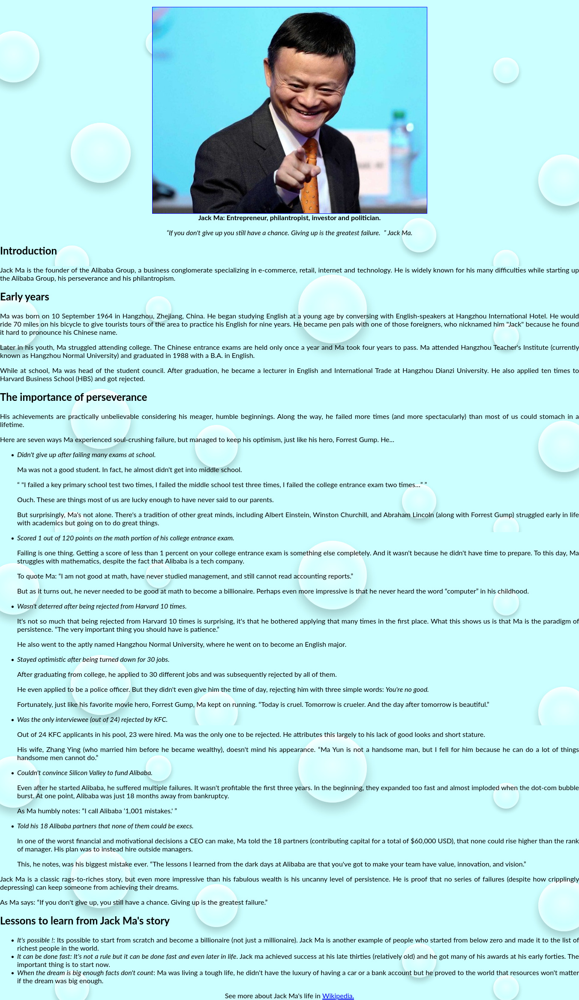

# Responsive Web Design: Tribute page

> Welcome to my project "Responsive Web Design: Tribute Page". This is a tribute page to Jack Ma, using html and css. Please enjoy and leave a comment.

# Screenshot

## Live Demo

[Live Demo Link](https://rawcdn.githack.com/alvarorf/FCC-ResponsiveWebDesign-tributePage/ee3560be0c20c809cf78c7110b1139ad624713f7/index.html)

## Getting Started

Simply download the zip and decompress. Once decompressed, double click or open index.html in any web browser.

## Authors

👤 **Alvaro Ruiz**

- Github: [@alvarorf](https://github.com/alvarorf)
- Twitter: [@aaruizf](https://twitter.com/aaruizf)
- Linkedin: [linkedin](https://www.linkedin.com/in/alvaro-r-22810915a/)

## 📝 License

This project is for the Freecodecamp curriculum.
